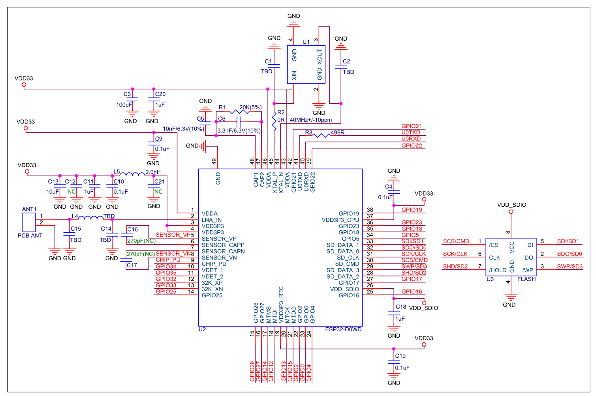

# ESP32芯片简介 # 
---

## 概述 ##
>ESP32 是集成 2.4 GHz Wi-Fi 和蓝牙双模的单芯片方案，采用台积电 (TSMC) 超低功耗的 40 纳米工艺，具有超高的射频性能、稳定性、通用性和可靠性，以及超低的功耗，满足不同的功耗需求，适用于各种应用场景。

## 功能框图 ##

### CPU和存储 ###
- Xtensa ® 32-bit LX6 单/双核处理器，运算能力高达 600 MIPS（除 ESP32-S0WD 为 200 MIPS，ESP32-D2WD为 400 MIPS）
- 448 KB ROM
- 520 KB SRAM
- 16 KB RTC SRAM
- QSPI 支持多个 flash/SRAM

### 时钟和定时器 ###
- 内置 8 MHz 振荡器，支持自校准
- 内置 RC 振荡器，支持自校准
- 支持外置 2 MHz 至 60 MHz 的主晶振（如果使用 Wi-Fi/蓝牙功能，则目前仅支持 40 MHz 晶振）
- 支持外置 32 kHz 晶振，用于 RTC，支持自校准
- 2 个定时器群组，每组包括 2 个 64-bit 通用定时器和 1 个主系统看门狗
- 1 个 RTC 定时器
- RTC 看门狗
 
### 高级外设接口 ###
- 34 个 GPIO 口
- 12-bit SAR ADC，多达 18 个通道
- 2 个 8-bit D/A 转换器
- 10 个触摸传感器
- 4 个 SPI
- 2 个 I²S
- 2 个 I²C
- 3 个 UART
- 1 个 Host SD/eMMC/SDIO
- 1 个 Slave SDIO/SPI
- 带有专用 DMA 的以太网 MAC 接口，支持 IEEE 1588
- CAN2.0
- IR (TX/RX)
- 电机 PWM
- LED PWM，多达 16 个通道
- 霍尔传感器
 
### 安全机制 ###
- 安全启动
- flash 加密
- 1024-bit OTP，用户可用的高达 768 bit
- 加密硬件加速器：AES,Hash(SHA-2),RSA,ECC,随机数生成器 (RNG)

## 应用 ##
- 智能照明
- 智能插座
- 智能门锁
- 照明控制
- 网络音乐播放器
- 音频流媒体设备
- 网络广播
- 健康监测
- 婴儿监控器
- 遥控玩具
- 距离感应玩具
- 早教机
- 智能手环

## 管脚布局 ##

## 参考设计 ##

## 电气特性 ##

## 产品命名 ##

## 学习资源 ##
### 必读资料 ###
>- [《ESP32 技术规格书》 ](https://www.espressif.com/sites/default/files/documentation/esp32_datasheet_cn.pdf)本文档为用户提供 ESP32 硬件技术规格简介，包括概述、管脚定义、功能描述、外设接口、电气特性等。
>- [《ESP-IDF 编程指南》 ](https://docs.espressif.com/projects/esp-idf/zh_CN/latest/index.html)ESP32 相关开发文档的汇总平台，包含硬件手册，软件 API 介绍等。
>- [《ESP32 技术参考手册》 ](https://www.espressif.com/sites/default/files/documentation/esp32_technical_reference_manual_cn.pdf)该手册提供了关于 ESP32 的具体信息，包括各个功能模块的内部架构、功能描述和寄存器配置等。
>- [ESP32 硬件资源 ](https://www.espressif.com/sites/default/files/documentation/esp32_technical_reference_manual_cn.pdf)压缩包提供了 ESP32 模组和开发板的硬件原理图，PCB 布局图，制造规范和物料清单。
>- [《ESP32 硬件设计指南》 ](https://www.espressif.com/sites/default/files/documentation/esp32_hardware_design_guidelines_cn.pdf)该手册提供了 ESP32 系列产品的硬件信息，包括 ESP32 芯片，ESP32 模组以及开发板。
>- [《ESP32 AT 指令集与使用示例》 ](https://www.espressif.com/sites/default/files/documentation/esp32_at_instruction_set_and_examples_cn.pdf)该文档描述 ESP32 AT 指令集功能以及使用方法，并介绍几种常见的 AT 指令使用示例。
>- [《乐鑫产品订购信息》 ](https://www.espressif.com/sites/default/files/documentation/espressif_products_ordering_information_cn.pdf)

 
### 必备资源 ###
>- [ESP32 在线社区 ](https://www.esp32.com/)工程师对工程师 (E2E) 的社区，用户可以在这里提出问题，分享知识，探索观点，并与其他工程师一起解
决问题。
>- [ESP32 GitHub ](https://github.com/espressif)乐鑫在 GitHub 上有众多开源的开发项目。
>- [ESP32 工具 ](http://www.espressif.com/zh-hans/support/download/other-tools?keys=&field_type_tid%5B%5D=13)ESP32 flash 下载工具以及《ESP32 认证测试指南》。
>- [ESP32 IDF ](https://github.com/espressif/esp-idf)Github IDF项目。
>-  [ESP32 ADF ](https://github.com/espressif/esp-adf)Github ADF项目。
>- [ESP32 资源合集 ](https://www.espressif.com/zh-hans/products/hardware/esp32/resources)ESP32 相关的所有文档和工具资源。

>- [ESP32芯片数据参考手册](https://www.espressif.com/sites/default/files/documentation/esp32_datasheet_cn.pdf)