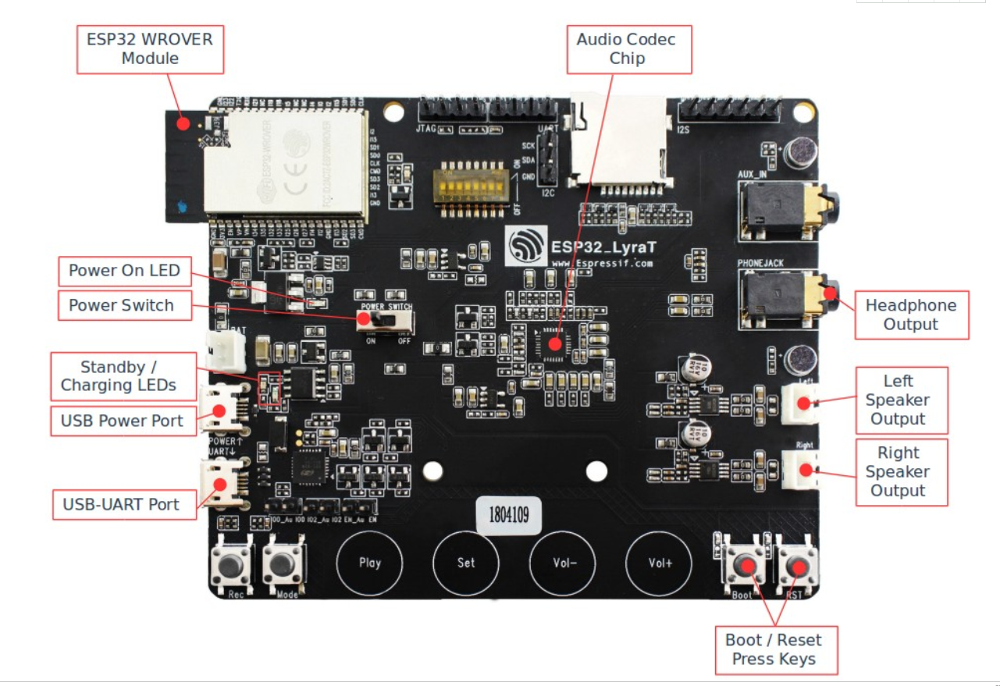

# ESP32 音频开发板简介 #
---
>笔者采用官方的ESP32-LyraT音频开发板

   
## 概述 ##
>ESP32-LyraT 是乐鑫专门为语音交互市场研发的一款音频开发板，采用的是 ESP32-WROVER 模组。该款模组集成度高，并且包含 4.5 MB RAM。ESP32-LyraT 基于 ESP32 双核处理器、带有强大的 Wi-Fi+BT 功能，只需搭配极少的外围器件即可实现高集成度的音频解决方案，快速开发出智能音响、智能故事机、智能家居等产品，极大地缩短了产品研发周期

## 功能描述 ##

- 支持多种音源输入：Wi-Fi、蓝牙音频、AirPlay、DLNA、line-in 等

- 双麦克拾音，可以开发近场以及远场语音识别

- 支持各种主流无损音频格式：ALAC, AAC, FLAC, OPUS, MP3, WAV, OGG 等

- 完整的无线标准——Wi-Fi 802.11b/g/n, Classic BT, BLE

- 支持多种配网：BLE 配网, Airkiss 配网等

- 外设接口丰富：有线网口, 触摸按键, TFT 屏幕, Camera 接口等，扩展性强，方便产品差异化

- 支持多种云平台：DuerOS, 喜马拉雅, 图灵机器人, DeepBrain 等。

## 硬件资源 ##

1. ESP32-WROVER 模组
    - ESP32-WROVER 是一款面向各类应用的 Wi-Fi+BT+BLE MCU 模组，功能强大，用途
广泛，可用于低功耗传感器器网络和要求严苛的应用，例如语音编码、音频流和 MP3 解
码等。详细信息请参考 ESP32-WROVER 技术规格书。
2. Micro SD 卡槽
    - 支持 SPI、一线、四线模式，用户可按需选择。
3. 音频输入接口 AUX_IN
    - ES8388 编解码器器的输入端。
4. USB-UART 接口和 USB 供电接口
    - USB 转 UART 功能：开发板采用 CP2102N-A01-GQFN28 芯片实现 USB 转 UART
功能，支持的波特率可达 3 Mbit/s。
    - USB 供电接口：Wi-Fi 模组处于工作状态时，峰值电流较大，乐鑫推荐使用供电能力为 500 mA 及以上的电源。
5. 触摸板
    - 开发板上共有 4 个触摸按钮，分别为：Play、Set、Vol+ 和 Vol-，作为音频功能按键，
具备无机械装置、可降低 BOM 成本、设计灵活等众多优点。
6. 扬声器器接口 
   - 支持两路路外部扬声器器。

## 学习资源 ##
### 必读资料 ###
>- [《ESP32 技术规格书》 ](https://www.espressif.com/sites/default/files/documentation/esp32_datasheet_cn.pdf)本文档为用户提供 ESP32 硬件技术规格简介，包括概述、管脚定义、功能描述、外设接口、电气特性等。
>- [《ESP-IDF 编程指南》 ](https://docs.espressif.com/projects/esp-idf/zh_CN/latest/index.html)ESP32 相关开发文档的汇总平台，包含硬件手册，软件 API 介绍等。
>- [《ESP32 技术参考手册》 ](https://www.espressif.com/sites/default/files/documentation/esp32_technical_reference_manual_cn.pdf)该手册提供了关于 ESP32 的具体信息，包括各个功能模块的内部架构、功能描述和寄存器配置等。
>- [ESP32 硬件资源 ](https://www.espressif.com/sites/default/files/documentation/esp32_technical_reference_manual_cn.pdf)压缩包提供了 ESP32 模组和开发板的硬件原理图，PCB 布局图，制造规范和物料清单。
>- [《ESP32 硬件设计指南》 ](https://www.espressif.com/sites/default/files/documentation/esp32_hardware_design_guidelines_cn.pdf)该手册提供了 ESP32 系列产品的硬件信息，包括 ESP32 芯片，ESP32 模组以及开发板。
>- [《ESP32 AT 指令集与使用示例》 ](https://www.espressif.com/sites/default/files/documentation/esp32_at_instruction_set_and_examples_cn.pdf)该文档描述 ESP32 AT 指令集功能以及使用方法，并介绍几种常见的 AT 指令使用示例。
>- [《乐鑫产品订购信息》 ](https://www.espressif.com/sites/default/files/documentation/espressif_products_ordering_information_cn.pdf)

### 必备资源 ###
>- [ESP32 在线社区 ](https://www.esp32.com/)工程师对工程师 (E2E) 的社区，用户可以在这里提出问题，分享知识，探索观点，并与其他工程师一起解
决问题。
>- [ESP32 GitHub ](https://github.com/espressif)乐鑫在 GitHub 上有众多开源的开发项目。
>- [ESP32 工具 ](http://www.espressif.com/zh-hans/support/download/other-tools?keys=&field_type_tid%5B%5D=13)ESP32 flash 下载工具以及《ESP32 认证测试指南》。
>- [ESP32 IDF ](https://github.com/espressif/esp-idf)Github IDF项目。
>-  [ESP32 ADF ](https://github.com/espressif/esp-adf)Github ADF项目。
>- [ESP32 资源合集 ](https://www.espressif.com/zh-hans/products/hardware/esp32/resources)ESP32 相关的所有文档和工具资源。

>- [ESP32芯片数据参考手册](https://www.espressif.com/sites/default/files/documentation/esp32_datasheet_cn.pdf)
>- [ESP32-WROVER 模组参考手册](https://www.espressif.com/sites/default/files/documentation/esp32_wrover_datasheet_cn.pdf )
>- [ESP32-LyraT使用指南](https://www.espressif.com/sites/default/files/documentation/esp32-lyrat_user_guide_cn.pdf )
>- [ESP32-LyraT 原理图](https://dl.espressif.com/dl/schematics/esp32-lyrat-v4.3-schematic.pdff )