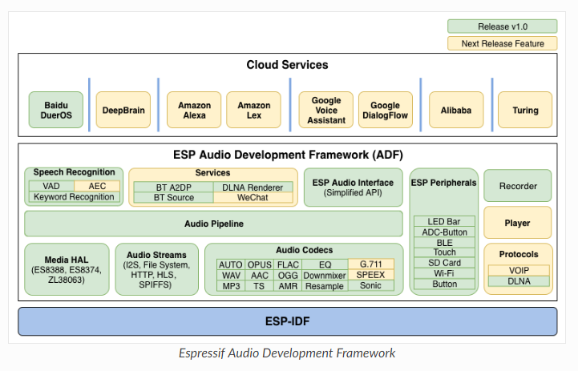
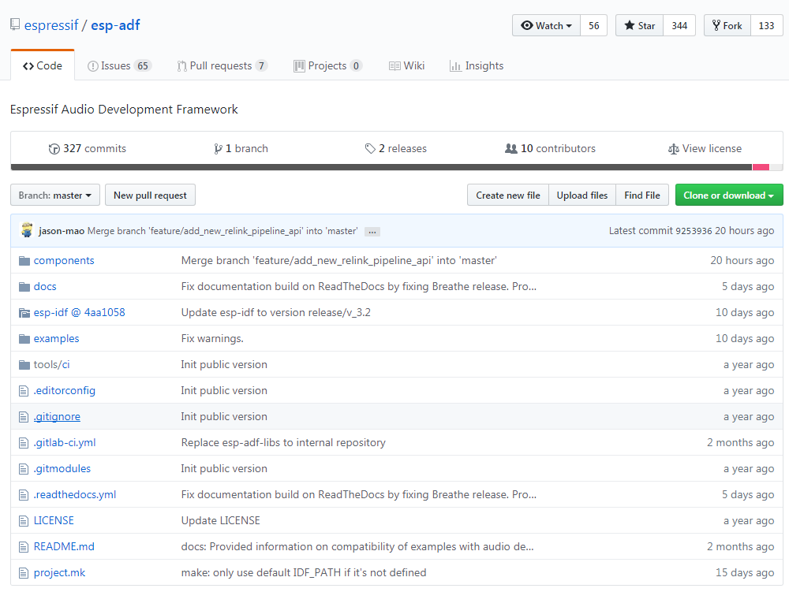

# ESP32-ADF 开发简介 #
---

## 概述 ##
ESP-ADF是Espressif专门为ESP32在音频领域设计的一套软硬件开发框架。ESP-ADF其实也是ESP-IDF下的一个扩展组件，所以在建立ESP-ADF开发环境时首先要配置ESP-IDF 开发环境。


## Github ##
以主线版为例：[ESP-ADF](https://github.com/espressif/esp-adf "ESP-ADF")


- ESP32功能组件
- 开发帮助文档
- 测试例程
- 工程编译配置
- 开发工具
- 使用简介README.md

## 快速入门 ##

### 配置工程 ###
`make menuconfig`

### 编译 ###
`make -j4 all`

### 烧写flash  ###
`make -j4 flash`

### 监视 ###
`make monitor`

退出 `Ctrl-]`

### 只编译应用程序 ###
`make app` 

### 并行编译 ###
 `make -jN` 其中 `N` 是并行编译数量 (通常是CPU的核数量加1)

```
make -j5 flash monitor
```

### 擦除 Flash ###
 `make erase_flash`


## 学习资源 ##
### 必读资料 ###
>- [《ESP32 技术规格书》 ](https://www.espressif.com/sites/default/files/documentation/esp32_datasheet_cn.pdf)本文档为用户提供 ESP32 硬件技术规格简介，包括概述、管脚定义、功能描述、外设接口、电气特性等。
>- [《ESP-IDF 编程指南》 ](https://docs.espressif.com/projects/esp-idf/zh_CN/latest/index.html)ESP32 相关开发文档的汇总平台，包含硬件手册，软件 API 介绍等。
>- [《ESP32 技术参考手册》 ](https://www.espressif.com/sites/default/files/documentation/esp32_technical_reference_manual_cn.pdf)该手册提供了关于 ESP32 的具体信息，包括各个功能模块的内部架构、功能描述和寄存器配置等。
>- [ESP32 硬件资源 ](https://www.espressif.com/sites/default/files/documentation/esp32_technical_reference_manual_cn.pdf)压缩包提供了 ESP32 模组和开发板的硬件原理图，PCB 布局图，制造规范和物料清单。
>- [《ESP32 硬件设计指南》 ](https://www.espressif.com/sites/default/files/documentation/esp32_hardware_design_guidelines_cn.pdf)该手册提供了 ESP32 系列产品的硬件信息，包括 ESP32 芯片，ESP32 模组以及开发板。
>- [《ESP32 AT 指令集与使用示例》 ](https://www.espressif.com/sites/default/files/documentation/esp32_at_instruction_set_and_examples_cn.pdf)该文档描述 ESP32 AT 指令集功能以及使用方法，并介绍几种常见的 AT 指令使用示例。
>- [《乐鑫产品订购信息》 ](https://www.espressif.com/sites/default/files/documentation/espressif_products_ordering_information_cn.pdf)


### 必备资源 ###
>- [ESP32 在线社区 ](https://www.esp32.com/)工程师对工程师 (E2E) 的社区，用户可以在这里提出问题，分享知识，探索观点，并与其他工程师一起解
决问题。
>- [ESP32 GitHub ](https://github.com/espressif)乐鑫在 GitHub 上有众多开源的开发项目。
>- [ESP32 工具 ](http://www.espressif.com/zh-hans/support/download/other-tools?keys=&field_type_tid%5B%5D=13)ESP32 flash 下载工具以及《ESP32 认证测试指南》。
>- [ESP32 IDF ](https://github.com/espressif/esp-idf)Github IDF项目。
>-  [ESP32 ADF ](https://github.com/espressif/esp-adf)Github ADF项目。
>- [ESP32 资源合集 ](https://www.espressif.com/zh-hans/products/hardware/esp32/resources)ESP32相关的所有文档和工具。

>- [ESP32芯片数据参考手册](https://www.espressif.com/sites/default/files/documentation/esp32_datasheet_cn.pdf )
>- [ESP32-WROVER 模组参考手册](https://www.espressif.com/sites/default/files/documentation/esp32_wrover_datasheet_cn.pdf )
>- [ESP32-LyraT使用指南](https://www.espressif.com/sites/default/files/documentation/esp32-lyrat_user_guide_cn.pdf )
>- [ESP32-LyraT 原理图](https://dl.espressif.com/dl/schematics/esp32-lyrat-v4.3-schematic.pdff )
>- [ESP32-IDF 编程指南](https://docs.espressif.com/projects/esp-idf/zh_CN/stable/index.html)
>- [ESP32-ADF 编程指南](https://docs.espressif.com/projects/esp-adf/en/latest/get-started/index.html)