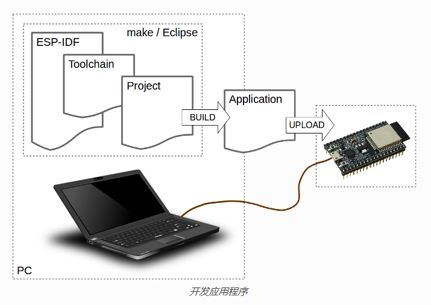
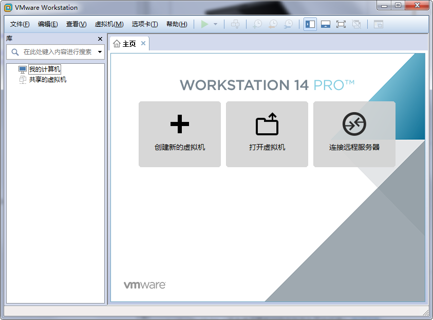

# 搭建ESP32开发环境(Ubuntu+VS) #

## 概述 ##
- 虚拟机下安装Ubuntu操作系统
- 安装必要的Ubuntu开发软件包
- 下载配置ESP32 Linux开发工具链
- 从 GitHub上获取 ESP-IDF 并设置环境
- 从 GitHub上获取 ESP-ADF 并设置环境
- 下载安装Vscode 编辑工具 ，配置Vscode环境
- 使用example中测试，配置，编译，下载，调试功能
- 其他问题

## 开始 ##
### 准备工作 ###
- wmware 14.0 （自行百度）
- ubuntu 18.04 （笔者使用最新的稳定版作为开发环境） [官网链接](https://www.ubuntu.com/download/desktop)
- Linux 版的 ESP32 工具链 （乐鑫官网，根据操作系统选择）
    - [64-bit Linux工具链](https://dl.espressif.com/dl/xtensa-esp32-elf-linux64-1.22.0-80-g6c4433a-5.2.0.tar.gz)
    - [32-bit Linux工具链](https://dl.espressif.com/dl/xtensa-esp32-elf-linux32-1.22.0-80-g6c4433a-5.2.0.tar.gz)

### 安装 wmware 14.0 ###
一路下一步自动安装，完成后。

### 安装 ubuntu 18.04 ###

http://101.44.1.4/files/2024000007B9FB9D/releases.ubuntu.com/18.04.2/ubuntu-18.04.2-desktop-amd64.iso