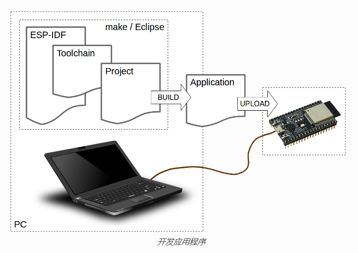
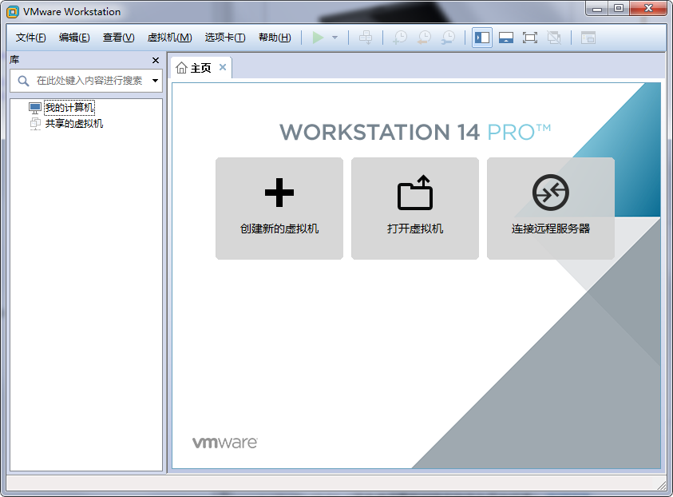
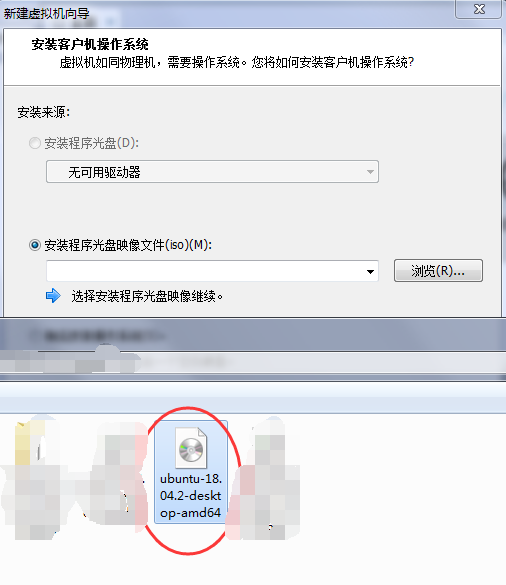
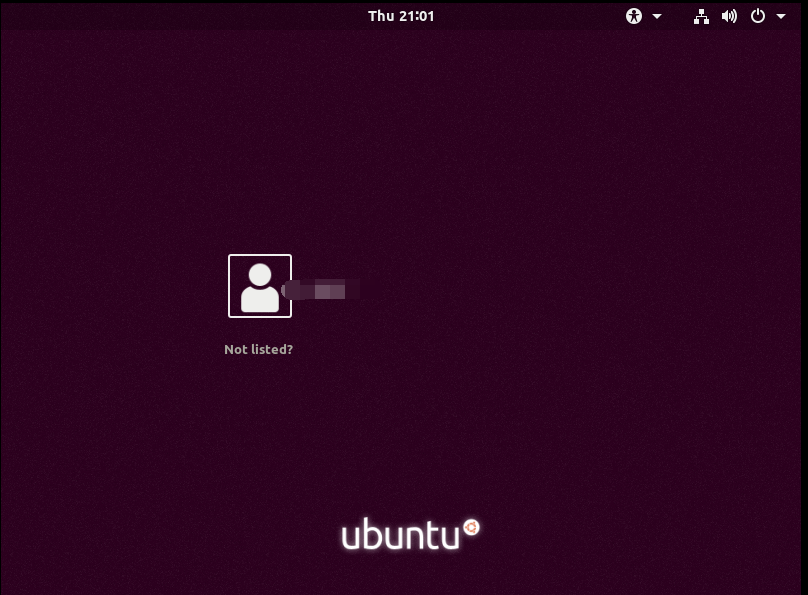
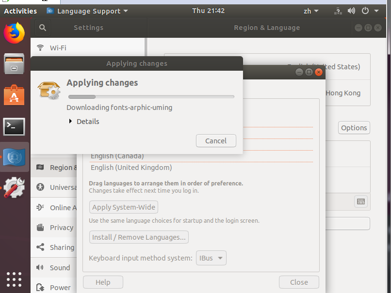
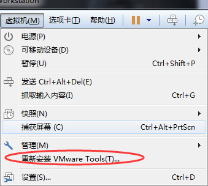
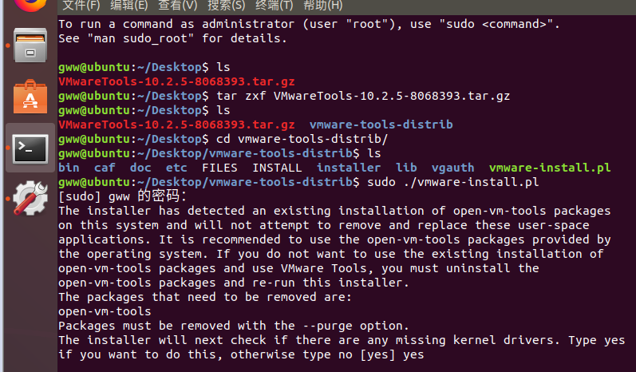
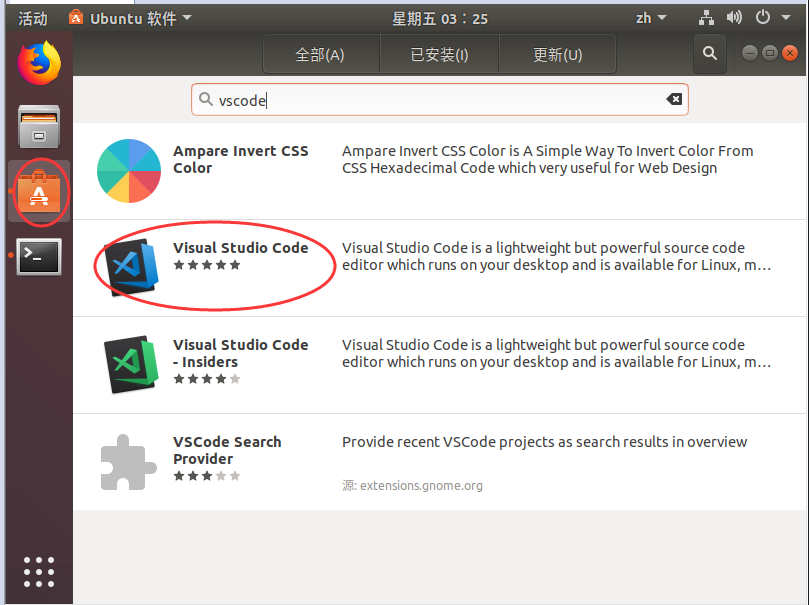

# 搭建ESP32开发环境(Ubuntu+VSCode) #

## 概述 ##
- 虚拟机下安装Ubuntu操作系统
- 安装必要的Ubuntu开发软件包
- 下载配置ESP32 Linux开发工具链
- 从 GitHub上获取 ESP-IDF 并设置环境
- 从 GitHub上获取 ESP-ADF 并设置环境
- 下载安装Vscode 编辑工具 ，配置Vscode环境
- 使用example中测试，配置，编译，下载，调试功能
- 其他问题

## 开始 ##
### 准备工作 ###
- wmware 14.0 （自行百度）
- ubuntu 18.04 （笔者使用最新的稳定版作为开发环境） [官网链接](https://www.ubuntu.com/download/desktop)
- Linux 版的 ESP32 工具链 （乐鑫官网，根据操作系统选择）
    - [64-bit Linux工具链](https://dl.espressif.com/dl/xtensa-esp32-elf-linux64-1.22.0-80-g6c4433a-5.2.0.tar.gz)
    - [32-bit Linux工具链](https://dl.espressif.com/dl/xtensa-esp32-elf-linux32-1.22.0-80-g6c4433a-5.2.0.tar.gz)

### 安装 wmware 14.0 ###
一路下一步自动安装，一番等待后完成，进入界面。

### 安装 ubuntu 18.04 ###
下载Ubuntu镜像：[ubuntu-18.04.2-desktop-amd64.iso](http://101.44.1.4/files/2024000007B9FB9D/releases.ubuntu.com/18.04.2/ubuntu-18.04.2-desktop-amd64.iso)

1. 新建虚拟机

2. ` 典型安装 `，选择我们刚刚下载的镜像

3. 进入 ` 简易安装 ` 模式，输入用户名密码，一定要记住以后登录需要（Ubuntu默认禁用root，我们可以使用` sudo ` 来获得暂时root权限）

4. 一路下一步，进入系统安装等待界面（漫长的等待...）

5. 安装完成后对使用性能不满意的，可以在 ` 关机 `后自行调整 ` 硬件配置 `（核数，内存），有助以后的编译速度

6. 一番等待后，进入系统登录，输入密码... 

7. 欢迎界面中可以选择我们需要的软件，然后再一番升级等待...重启
   
8. 正式进入Ubuntu，先个性化设置一番我们的`Ubuntu`系统，
     - 在` setting `-` language ` 中选择安装我们母语，输入法，再一番等待 
     
     - 安装完成后，再语言选择中将 ` 汉语（中国） ` 的选项 ` 拖到 ` 最上边，再将设置应用，重启系统
     - 重启登录后，系统会提示是否修改文件夹名，这里最好选择 ` 保留原有名称 `，不然以后再 ` 终端 `内 ` cd `来` cd `去不停操作中文目录，不能使用` tab `，是一件不友好的事情。
     - 接下来安装 `wmware tools`,点击选择` 虚拟机 ` - ` 重新安装 wmware tools `,接着 `/media/xxx`会出现安装包 `VMwareTools-10.2.5-8068393.tar.gz`,我们将其 `复制` 到桌面上，我们再打开` 终端 ` 解压缩（也可以直接右键直接 ` 提取到此处 `，相当Windows 的 `解压到当前`）,安装输入命令 `sudo ./vmware-install.pl `,按提示输入密码，接着又是一番 `yes` 加回车，完成。
     
     
     - 这样就可以愉快的`Ubuntu` 和`windows` 界面来回切换不用 `Ctrl + Alt` ，主机和虚拟机之间` 复制粘贴 `也可以，文件共享方便多了。
     - 更新软件列表 ` sudo apt-get update`,更新软件` sudo apt-get upgrade `
     - 常用的软件可以拖动到 桌面的左面栏，方便使用。

9. 在Ubuntu内安装 ` vscode ` 
    - 软件在 `Ubuntu软件`内找到，点击`安装`，这和 APP store 很像。又是一番等待...
    
    - 安装完成后，设置VScode 的开发环境，安装插件`language` , ` c\c++`...，笔者使用的`Settings Sync`,一建同步原来配置（现在笔者使用的时候是原来配置好的，需要`github`的账号，现在开发基本都在VScode上，包括现在编写的开发历程，确实非常好用的轻量编辑器，当然这也是有强大的插件库的原因）
    - 输入`shift + ctrl + d`，输入原来`GitHub Token`,`GitHub Gist`,又是一番同步配置等待，完成后重启vscode
    - 新打开提示没有 `git` ，我们安装下git `sudo apt-get install git`.